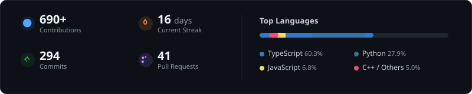

### Hi, I'm Pranay 👋

> Building intelligent systems that move from research to real-world deployment.

`Autonomous Agents` &nbsp;•&nbsp; `Edge Computer Vision` &nbsp;•&nbsp; `LLM Evals` &nbsp;•&nbsp; `Systems`

  &nbsp;
  

---

 

  

